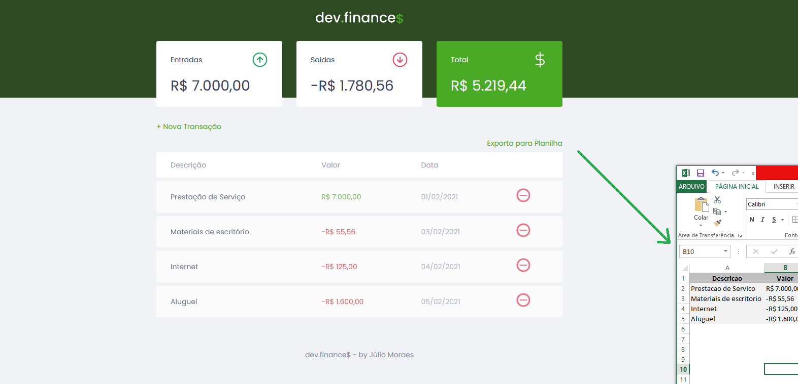

<h1 align="center">
  
</h1>

  <a href="#-tecnologias">Tecnologias</a>&nbsp;&nbsp;&nbsp;|&nbsp;&nbsp;&nbsp;
  <a href="#-projeto">Projeto</a>&nbsp;&nbsp;&nbsp;|&nbsp;&nbsp;&nbsp;
  <a href="#-layout">Layout</a>&nbsp;&nbsp;&nbsp;|&nbsp;&nbsp;&nbsp;
  <a href="#memo-licença">Licença</a>

 

  

 

  
  

##  Tecnologias

Projeto desenvolvido com as seguintes tecnologias:

- HTML
- CSS
- JavaScript

##  Projeto

Aplicação de controle financeiro, desenvolvida na Maratona Discover, uma realização da Rocketseat (Prof. Mayk Brito).

Funcionalidades:

É possível cadastrar e excluir transações, visualizar total das entradas e saídas, bem como o saldo disponível.

##  Layout

Você pode visualizar o layout do projeto através [desse link](https://www.figma.com/file/7Vu9DzUaCZIV4nibzkjgB4/dev.finance%24-Maratona-Discover). É necessário ter conta no [Figma](https://figma.com) para acessá-lo.

## :memo: Licença

Esse projeto está sob a licença MIT. Veja o arquivo [LICENSE](LICENSE.md) para mais detalhes.

