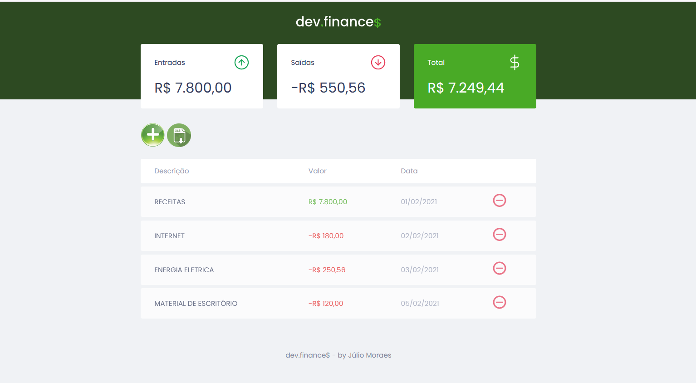

<h1 align="center">
  
</h1>

  <a href="#-tecnologias">Tecnologias</a>&nbsp;|&nbsp;
  <a href="#-finalidade">Finalidade</a>&nbsp;|&nbsp;
  <a href="#-projeto">Projeto</a>&nbsp;|&nbsp;
  <a href="#-layout">Layout</a>&nbsp;|&nbsp;
  <a href="#memo-licença">Licença</a>

 

  

 

  
  

##  Tecnologias

Projeto desenvolvido com as seguintes tecnologias:

- HTML
- CSS
- JavaScript

## Finalidade

Estudo e aplicação de novas técnicas.

##  Projeto

Aplicação de controle financeiro, desenvolvida na Maratona Discover, uma realização da Rocketseat (Prof. Mayk Brito).

Funcionalidades:

É possível cadastrar e excluir transações, visualizar os totais das entradas e saídas, bem como o saldo disponível.

##  Minhas Personalizações

Acrescentei dois botões, um para nova transação e outro para gerar exportação do extrato para planilha. 
Criei função retira acentos, pois ao exportar para planilha, estava dando problema nas palavras com acento.
## Para visualizar e testar online: https://julioambos.github.io/maratona-discover/

##  Layout

Você pode visualizar o layout do projeto através [desse link](https://www.figma.com/file/7Vu9DzUaCZIV4nibzkjgB4/dev.finance%24-Maratona-Discover). É necessário ter conta no [Figma](https://figma.com) para acessá-lo.

## Agradecimentos

A dedicação do professor Mayk Brito. Muito obrigado Professor! 

